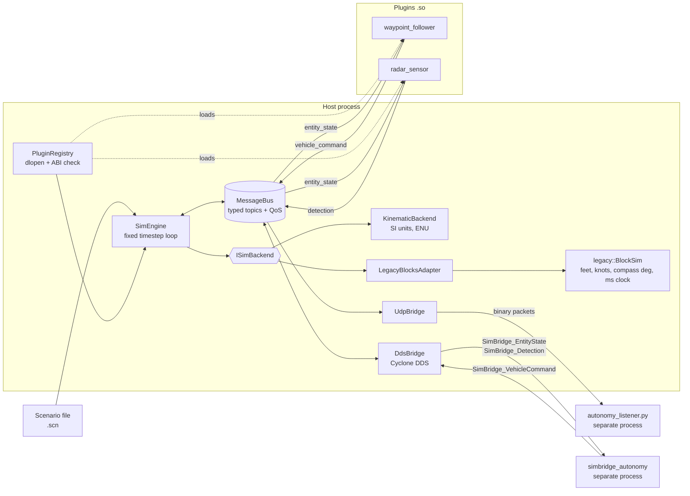

# SimBridge

A C++17 framework that connects simulation backends to autonomy software through
runtime loaded plugins, backend adapters, a typed publish/subscribe bus, and a
DDS transport (Eclipse Cyclone DDS) for autonomy running in other processes.

The goal is the one a simulation framework team has: let autonomy and sensor
developers write a model **once**, and run it against any simulator without
knowing that simulator's units, frames, clock, or API.

```
$ ./build/simbridge_run scenarios/coastal_patrol.scn --backend legacy_blocks
scenario  coastal_patrol  backend legacy_blocks  entities 3  sensors 1
steps 3600  sim 180.000 s  wall 0.003 s  (59690.8x real time)
messages 18323  commands 7200  detections 323
```

## Architecture



Each frame at time *t*:

1. The engine reads ground truth from the active backend and publishes it on `entity_state`.
2. Every plugin model steps. Models only see SimBridge messages; they publish
   `vehicle_command` (steering) and `detection` (sensor reports).
3. Commands are forwarded to the backend, which advances by *dt*.

## Components

| Component | What it does | Where |
| --- | --- | --- |
| `MessageBus` | Named topics bound to one C++ type (mismatch throws, like a DDS type check). Optional KEEP_LAST(N) history replayed to late subscribers. Thread safe publish; callbacks run outside the lock. | `include/simbridge/message_bus.hpp` |
| `PluginRegistry` | Loads model plugins with `dlopen`, checks an ABI version, rejects duplicates, creates instances by type name. | `src/plugin_registry.cpp` |
| `ISimBackend` | The adapter interface every simulator sits behind. | `include/simbridge/backend.hpp` |
| `KinematicBackend` | The "new" framework: SI units, ENU frame, turn rate and acceleration limits. | `src/kinematic_backend.cpp` |
| `legacy::BlockSim` | Stand in for a legacy framework with a deliberately different API: feet, knots, compass degrees, an integer millisecond clock, its own ids. | `src/legacy_block_sim.cpp` |
| `LegacyBlocksAdapter` | Translates every legacy convention to SimBridge's, including carrying sub millisecond remainders so odd timesteps do not drift. | `src/legacy_blocks_adapter.cpp` |
| Scenario loader | Line oriented scenario format with validation errors that report the line number. | `src/scenario.cpp` |
| Wire format + `UdpBridge` | Versioned little endian binary encoding; streams bus traffic to another process over UDP. | `src/wire.cpp`, `src/udp_bridge.cpp` |
| Python client | Decodes the same wire format in a separate process: a stand in autonomy consumer. | `tools/autonomy_listener.py` |
| `DdsBridge` | Publishes entity state and detections on DDS topics and feeds DDS vehicle commands back onto the bus. Types defined in IDL, generated with `idlc`. | `src/dds_bridge.cpp`, `idl/simbridge_types.idl` |
| `simbridge_autonomy` | Example autonomy process: reads state over DDS and flies an interceptor onto a target with lead pursuit. Links no simulation code. | `apps/simbridge_autonomy.cpp` |

## DDS transport

`--dds DOMAIN` connects a run to a DDS domain. Any DDS application that uses
the same IDL types and topic names can watch the simulation or drive vehicles in it.

| Topic | Direction | Type | QoS |
| --- | --- | --- | --- |
| `SimBridge_EntityState` | out | `simbridge_dds::EntityState`, keyed by `id` | RELIABLE, TRANSIENT_LOCAL, KEEP_LAST(1) per entity |
| `SimBridge_Detection` | out | `simbridge_dds::Detection` | RELIABLE, VOLATILE |
| `SimBridge_VehicleCommand` | in | `simbridge_dds::VehicleCommand`, keyed by `entity_id` | RELIABLE, VOLATILE, newest per entity |

* **Late joiners see the whole world at once.** Entity state is keyed, so a
  reader that starts mid run immediately receives the latest state of every
  entity, not just the last sample written.
* **Commands are applied on the simulation thread.** They wait inside DDS until
  the loop calls `poll_commands()` once per frame, so no backend call ever
  happens on a DDS thread.
* **External vehicles.** An entity with `model = external` has no plugin and
  only moves when commands arrive, which is how an outside autonomy stack takes
  control of it.
* **Optional.** CMake finds Cyclone DDS automatically (`SIMBRIDGE_WITH_DDS` =
  `AUTO`, `ON` or `OFF`). Without it, everything else still builds and tests;
  CI runs both configurations.

Two process intercept demo:

```bash
./build/simbridge_run scenarios/dds_intercept.scn --dds 0 --realtime &
./build/simbridge_autonomy --domain 0 --interceptor 10 --target 1
# autonomy: tracking target at t=1.00 s, range 725 m
# autonomy: CAPTURE at t=40.30 s, range 29.7 m, 795 commands sent
```

## Migrating between backends safely

`legacy_blocks` and `kinematic` must produce the same trajectories, otherwise a
program cannot move from one to the other. Two tests enforce that:

* **Open loop parity** (`BackendParity.OpenLoopTrajectoriesMatch`): both adapters
  receive an identical 4,000 step maneuver schedule; positions must agree within
  **1 micrometer** at every step. Any unit, frame, or clock bug fails this.
* **Closed loop parity** (`Engine.ClosedLoopParityAcrossBackends`): the full
  scenario, plugins included. Waypoint arrival is a threshold event, so 1e-13
  rounding differences can move a waypoint switch by one frame; the test allows
  that and checks final positions within 5 m and detection counts within 2%.

## Build and test

Requires CMake 3.16+ and a C++17 compiler (GCC 9+ or Clang 10+) on Linux.
GoogleTest is fetched automatically. For the DDS transport, install Cyclone DDS:

```bash
sudo apt-get install cyclonedds-dev cyclonedds-tools   # Ubuntu 24.04
```

```bash
cmake -S . -B build
cmake --build build -j
ctest --test-dir build --output-on-failure      # 58 tests (51 without DDS)

# memory and undefined behavior checks
cmake -S . -B build-asan -DCMAKE_BUILD_TYPE=Debug -DSIMBRIDGE_SANITIZE=ON
cmake --build build-asan -j && ctest --test-dir build-asan
```

Test coverage:

| Suite | Checks |
| --- | --- |
| `MessageBus` | fan out, topic isolation, type mismatch, history replay, unsubscribe, reentrant publish, 4 threads x 10,000 concurrent publishes with no loss |
| `Scenario` | parsing, and line numbered errors for bad numbers, missing keys, unknown backends, duplicate ids, dangling sensor hosts, malformed sections |
| `PluginRegistry` | directory loading, independent instances, missing files, **ABI mismatch rejection**, duplicate types |
| `Backends` | straight line motion, turn rate and acceleration limits on both adapters, legacy unit conversion, millisecond remainder handling, open loop parity |
| `Wire` | round trips, byte layout, truncated / wrong type / bad magic / bad version packets |
| `Engine` | end to end scenario run, waypoint arrival, radar range and field of view, seeded reproducibility, closed loop parity, late joiner replay, external entities, unknown model types |
| `DdsBridge` | all fields round trip over DDS, late joiner gets every entity's latest state, detections, commands held until polled, direction options, clean unsubscribe, **closed loop control of an external entity over DDS** |
| `UdpBridge` | real packets over loopback decoded on the receiver, clean unsubscribe, bad addresses |

## Run it

```bash
./build/simbridge_run scenarios/coastal_patrol.scn
./build/simbridge_run scenarios/coastal_patrol.scn --backend legacy_blocks --csv tracks.csv
./build/simbridge_bench
```

Stream to a separate process:

```bash
python3 tools/autonomy_listener.py --port 47000 &
./build/simbridge_run scenarios/coastal_patrol.scn --udp 127.0.0.1:47000
# t=   1.80s  NEW CONTACT target 3 range  1200.3 m  bearing   14.7 deg
# t=  61.60s  NEW CONTACT target 2 range  1175.4 m  bearing   57.8 deg
```

UDP is best effort. Running thousands of times faster than real time overflows
the receiver's socket buffer and drops packets; `--realtime` paces the loop to the
wall clock so a live consumer keeps up. That trade off is why the bus, not the
network link, is the system of record.

## Performance

Measured with `simbridge_bench` on a 2 core cloud VM, Release build:

| Benchmark | Result |
| --- | --- |
| Bus, 1 publisher, 4 subscribers | ~25 M publishes/s, ~99 M deliveries/s |
| Engine, 200 entities + 20 radars, `kinematic` | ~9,200 steps/s (~460x real time at 20 Hz) |
| Engine, same scenario, `legacy_blocks` | ~7,900 steps/s (~400x real time) |
| Engine, same scenario, publishing everything over DDS | ~0.4 to 0.5 M DDS samples/s (~31x real time) |

## Writing a plugin

```cpp
#include "simbridge/model.hpp"

class Loiter final : public simbridge::IModel {
public:
    void configure(const simbridge::ModelInit& init) override {
        id_ = init.self_id;
        radius_ = init.spec.get_double_or("radius_m", 200.0);
    }
    void step(const simbridge::ModelContext& ctx) override {
        if (!ctx.host) return;
        simbridge::VehicleCommand cmd{id_, ctx.t, ctx.host->heading_rad + 0.1, 15.0};
        ctx.bus.publish(simbridge::topics::kVehicleCommand, cmd);
    }
private:
    uint32_t id_ = 0;
    double radius_ = 200.0;
};

SIMBRIDGE_DECLARE_PLUGIN("loiter", Loiter)
```

Add `simbridge_add_plugin(loiter plugins/loiter/loiter.cpp)` to `CMakeLists.txt`
and reference `model = loiter` in a scenario. The plugin works on every backend.

## Design decisions

* **Plugins never touch a backend.** They read `ModelContext` and publish
  messages. That is what lets one compiled plugin run on every adapter.
* **ABI versioned plugin entry points.** `extern "C"` factories plus a version
  check turn a silent crash from a stale `.so` into a clear load error.
* **Conversions live only in adapters.** Units, frames, headings, clocks and
  ids are translated in one file per backend and nowhere else.
* **Deterministic by construction.** Fixed timestep, ordered entity iteration,
  and per sensor RNG streams seeded from the scenario seed make runs repeatable
  bit for bit, which is what makes regression tests on simulation output possible.
* **Topics declared by the host first.** Topic objects are created by host
  code, never inside a plugin library, so unloading a plugin cannot leave the bus
  holding code from an unmapped library.

## Roadmap

* An image generator bridge for visual sensor plugins
* DDS security and a configurable QoS profile file
* Scenario import from a standard scenario interchange format

## License

MIT
